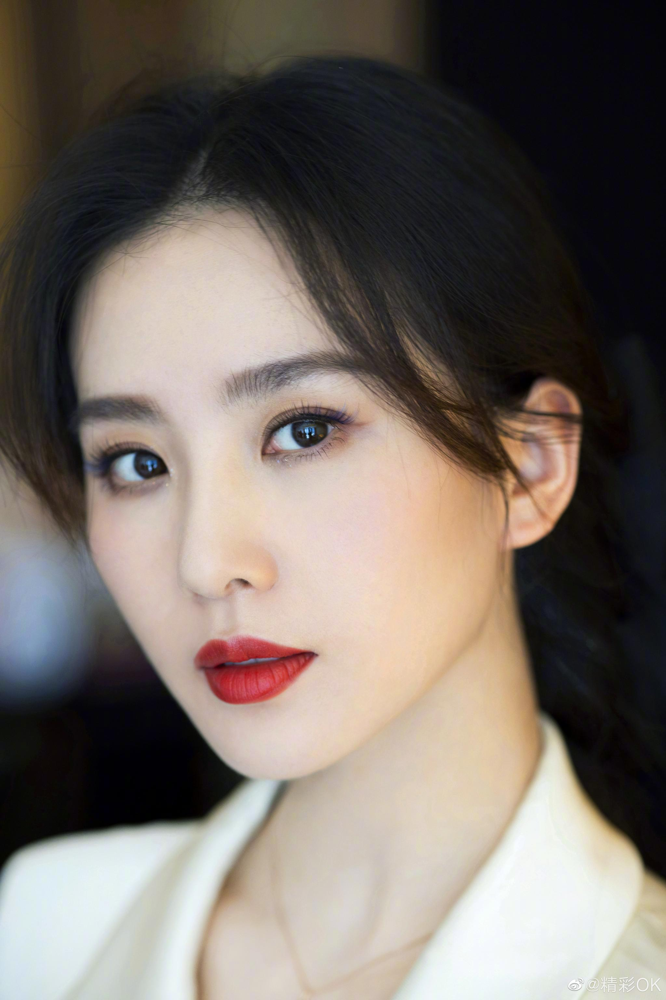
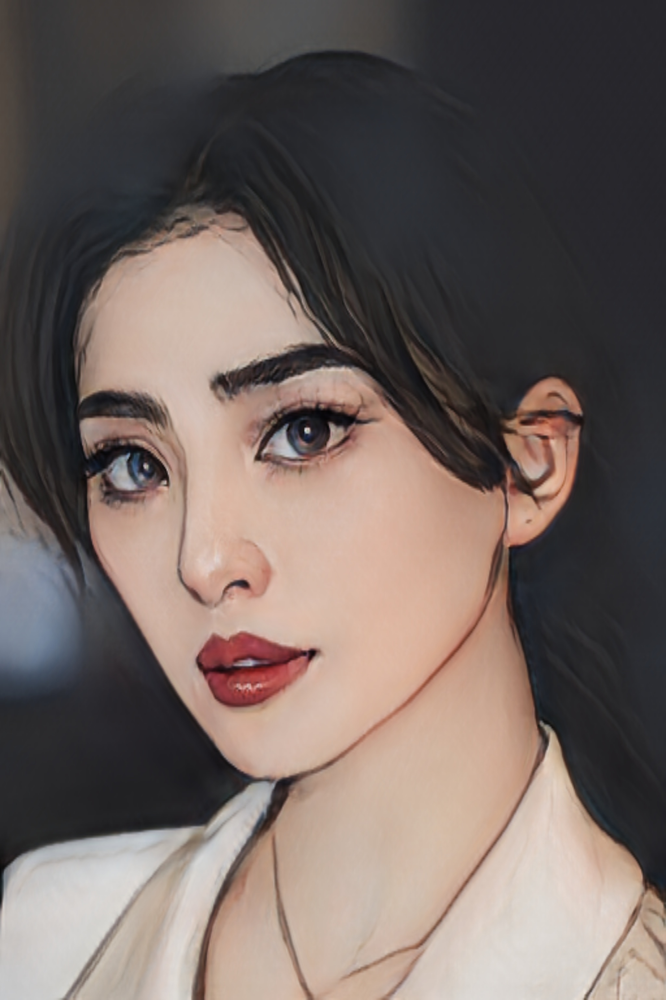

# AnimeGAN-onnxruntime
使用ONNXRuntime部署人脸动漫化——AnimeGAN，包含C++和Python两个版本的代码实现

起初我打算使用opencv部署的，但是opencv 的dnn模块读取.onnx文件出错了。
于是使用onnxruntime部署，C++版本的主程序是main.cpp，Python版本的主程序是main.py
除此之外，不在导入其他的程序文件，做到程序的极简高效
# Usage
只针对 Macos 平台, 执行 `make depend` 拉取 opencv, onnxruntime 依赖, 再 `make build` 构建, 最后 `make run` 即可.
# Compare
)
